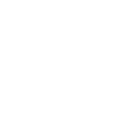
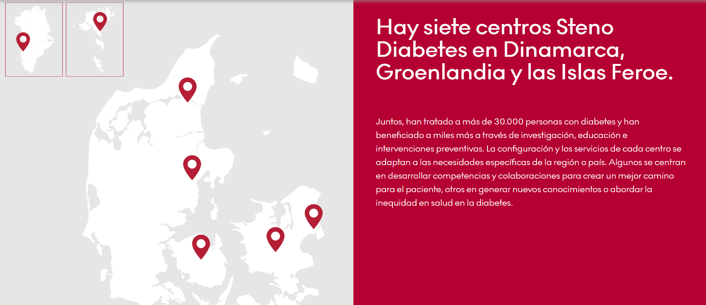
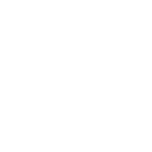
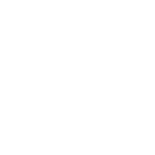
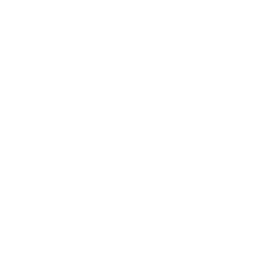
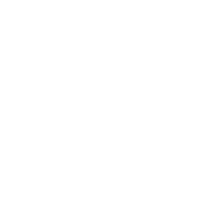
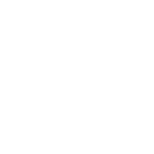

##  {.slide-dark background-color="#0A3B36"}

::: big-title
Introducción al uso de registros nacionales de salud para investigación
:::

::: tagline
Estructuras, Experiencias, Ejercicios
:::

::: meta
Septiembre 2026\
Daniel R. Witte · Aarhus University / Steno Diabetes Center Aarhus
:::

::: dots
:::

## {.tico} Cómo está organizado este curso

::::::::::: {.numlist .tall}
:::::: numcard
::: num
01
:::

:::: ncontent
::: nc-title
Sesión Virtual (28-08-2026)
:::

- Presentación del ponente
- Introducción de conceptos centrales
- Preparación del sistema de análisis (R)
::::
::::::

:::::: numcard
::: num
02
:::

:::: ncontent
::: nc-title
Sesión Presencial (10-09-2026)
:::

- El potencial de los registros
- De los datos crudos a una pregunta de investigación
- Manos a la obra: un análisis sencillo
- Cierre. Ideas y discusión
::::
::::::
:::::::::::

## Presentación

:::::: numlist
::::: numcard
::: num
 
:::

::: ncontent
- Formación en medicina (Universidad de Utrecht – Holanda)
- Profesor de Epidemiología de la Diabetes en la universidad de Aarhus
  (Dinamarca) y el Steno Diabetes Center Aarhus
- Experiencia con trabajos de cohorte, ensayos clínicos y análisis de
  registros
:::
:::::
::::::

::: figure-card

:::

## {.tico} Cómo está organizada esta sesión

::::::::::::::::::: {.numlist .slim}
:::::: numcard
::: num
01
:::

:::: ncontent
::: nc-title
Presentación
:::
::::
::::::

:::::: numcard
::: num
02
:::

:::: ncontent
::: nc-title
Conceptos centrales
:::

¿Qué es un registro?
::::
::::::

:::::: numcard
::: num
03
:::

:::: ncontent
::: nc-title
Preparación para los ejercicios prácticos
:::

Instalación del paquete estadístico R y paquetes de análisis específicos
::::
::::::

:::::: numcard
::: num
04
:::

:::: ncontent
::: nc-title
Preguntas
:::
::::
::::::
:::::::::::::::::::

## {.tico} ¿A que tipo de preguntas puede responder un registro?

::::::::::::::::::: cardgrid
:::::: icard
:::: ic-head
{.ic-icon}

::: ic-title
¿Cuántas personas viven con diabetes y cuántas se diagnostican cada año?
:::
::::

::: ic-body
Prevalencia e incidencia, por tipo (T1/T2), edad, sexo, territorio\
Tasas totales, no una estimación basada en muestreo
:::
::::::

:::::: icard
:::: ic-head
{.ic-icon}

::: ic-title
¿Reciben la atención que deberían recibir?
:::
::::

::: ic-body
Exámenes, controles, medicación:

- Cobertura efectiva
- Calidad de servicios clínicos
:::
::::::

:::::: icard
:::: ic-head
{.ic-icon}

::: ic-title
¿Qué complicaciones desarrollan, y cuándo?
:::
::::

::: ic-body
Retinopatía, nefropatía, amputaciones, eventos cardiovasculares, a lo
largo del tiempo.
:::
::::::

:::::: icard
:::: ic-head
{.ic-icon}

::: ic-title
¿Cuánto antes mueren, y de qué?
:::
::::

::: ic-body
Mortalidad, exceso de mortalidad y años de vida perdidos en comparación
con la población general.
:::
::::::
:::::::::::::::::::

::: callout-gold
**Ninguna de estas preguntas se responde completamente con una encuesta
transversal ni con un ensayo clínico.**\
**Una característica principal de los registros es la observación de una
población completa, de forma continua, durante años.**
:::

## {.tico} ¿Quién usa un registro y para qué?

::: subtitle
El mismo registro puede servir para responder a preguntas distintas,
según quién pregunte
:::

::: t-usuarios
| Nivel y usuario | La pregunta que hace | El producto que necesita |
|----|----|----|
| Gobierno nacional<br>Ministerio, seguridad social | ¿Cuánta enfermedad hay, dónde y con qué desenlaces? ¿La política está funcionando? | Indicadores nacionales comparables en el tiempo, series de incidencia y mortalidad, proyecciones |
| Gobierno regional y local<br>Secretarías, municipios | ¿Qué territorios están peor y dónde faltan servicios? | Tasas por distrito con denominadores poblacionales, mapas, comparación entre pares |
| Sistema de salud o asegurador | ¿Dónde se concentra el costo evitable y la brecha de atención? | Cohortes de riesgo, cobertura efectiva por prestador, costos atribuibles |
| Servicio o establecimiento | ¿Cómo estamos frente a centros comparables? | Tableros de proceso y resultado, con ajuste por composición de la población atendida |
| Profesional clínico | ¿Cuáles de mis pacientes están fuera de control o sin control anual? | Listas nominales accionables y comparación con sus pares — no un informe agregado |
| Universidad o equipo de investigación | ¿Qué causa qué? ¿Qué intervención funciona y en quién? | Microdatos seudonimizados, enlace con otras fuentes, años de historia, entorno seguro |
| Paciente y ciudadano | ¿Qué se sabe de mí, quién lo usa y para qué? ¿Cómo estoy frente a otros? | Acceso a sus propios datos, resultados agregados publicados, transparencia sobre los usos |
:::

## {.tico} ¿Qué niveles de registros sanitarios existen?

::: subtitle
La respuesta depende del nivel: cada uno necesita información distinta y
usa herramientas distintas
:::

::: t-niveles
| Nivel | Necesidades de información | Herramientas |
|----|----|----|
| Global | Indicadores agregados por país y región | Informes mundiales (OCDE, OMS, Banco Mundial) |
| Nacional | Indicadores para planificación, mejora de la equidad, distribución de recursos | Informes nacionales (ministerios, bancos de datos, universidades) |
| Servicio de salud | Indicadores por centro y territorio para planificar y seguir la actividad | Informes, central de resultados |
| Organización sanitaria | Compras, gestión financiera, medicamentos, gestión de citas | Bases de datos y aplicaciones de gestión |
| Paciente | Cuidado del paciente | Historia clínica |
| Comunitario | Seguimiento de la población y cambios demográficos | Censo, registro civil, estadísticas de mortalidad |
:::

## {.tico} ¿Qué es un registro sanitario?

::: subtitle
Un sistema organizado que recoge datos uniformes sobre una población
definida por una enfermedad, condición o exposición (EMA, 2021)
:::

```{=html}
<div class="hub">
  <svg viewBox="0 0 1164 426" preserveAspectRatio="none">
    <g stroke="#9FB8B4" stroke-width="2" fill="none">
      <line x1="582" y1="203" x2="582" y2="100"/>
      <line x1="582" y1="203" x2="763" y2="127"/>
      <line x1="582" y1="203" x2="763" y2="280"/>
      <line x1="582" y1="203" x2="582" y2="307"/>
      <line x1="582" y1="203" x2="402" y2="280"/>
      <line x1="582" y1="203" x2="402" y2="127"/>
    </g>
  </svg>
  <div class="node" style="left:443.5px; top:0px;">
    <div class="n-title">Metadatos</div><div class="n-sub">diccionario, códigos, linaje</div>
  </div>
  <div class="node" style="left:763.2px; top:76.8px;">
    <div class="n-title">Documentación</div><div class="n-sub">protocolo, algoritmo, calidad</div>
  </div>
  <div class="node" style="left:763.2px; top:230.4px;">
    <div class="n-title">Infraestructura informática</div><div class="n-sub">enlace, entorno seguro, respaldo</div>
  </div>
  <div class="node" style="left:443.5px; top:307.2px;">
    <div class="n-title">Reglas de acceso</div><div class="n-sub">quién, cómo y en cuánto tiempo</div>
  </div>
  <div class="node" style="left:123.8px; top:230.4px;">
    <div class="n-title">Marco institucional</div><div class="n-sub">quién lo mantiene y con qué fondos</div>
  </div>
  <div class="node" style="left:123.8px; top:76.8px;">
    <div class="n-title">Marco legal</div><div class="n-sub">base jurídica del uso secundario</div>
  </div>
  <div class="core">DATOS</div>
</div>
```

::: callout-gold
**Un registro no es una base de datos.** Es una base de datos más los
seis elementos que la hacen interpretable, legítima, mantenible y
accesible. Los proyectos fallan casi siempre por los seis, no por el
primero.
:::

::: source
Definición: EMA, Guideline on registry-based studies, EMA/426390/2021. ·
Estructura de componentes: Zaletel & Kralj (PARENT JA, 2015); Gliklich
et al. (AHRQ, 4.ª ed., 2020).
:::

##  {background-image="images/screenshot-dge-portal.png" background-size="contain" background-color="#ffffff"}

##  {background-image="images/screenshot-datos-abiertos.png" background-size="contain" background-color="#ffffff"}

##  {background-image="images/screenshot-sala-situacional-diabetes.png" background-size="contain" background-color="#ffffff"}

```{=html}
<!-- This slide is HIDDEN in the original .pptx. Quarto removes slides marked
     {visibility="hidden"} from the output entirely, so it is left visible here.
     Add {visibility="hidden"} to the heading below to drop it again. -->
```

## {.tico} Componentes de un sistema de información en salud

::: subtitle
Un registro se apoya en los seis; si falta uno, el registro no se
sostiene
:::

::::::::::::::::::::::::::: {.cardgrid .cols-3}
:::::: {.icard .compact .flush}
:::: ic-head
{.ic-icon}

::: ic-title
Recursos
:::
::::

::: ic-body
Marco legal, normativa y planificación; personal, financiamiento,
logística y tecnología.
:::
::::::

:::::: {.icard .compact .flush}
:::: ic-head
{.ic-icon}

::: ic-title
Indicadores
:::
::::

::: ic-body
Conjunto acordado de indicadores y metas, con sus definiciones, a lo
largo de toda la cadena.
:::
::::::

:::::: {.icard .compact .flush}
:::: ic-head
{.ic-icon}

::: ic-title
Fuentes de datos
:::
::::

::: ic-body
Basadas en la población (censo, registro civil, encuestas) y en las
instituciones (registros de servicios).
:::
::::::

:::::: {.icard .compact .flush}
:::: ic-head
{.ic-icon}

::: ic-title
Gestión de datos
:::
::::

::: ic-body
Recolección, almacenamiento, control de calidad, procesamiento, flujo y
compilación.
:::
::::::

:::::: {.icard .compact .flush}
:::: ic-head
{.ic-icon}

::: ic-title
Productos de información
:::
::::

::: ic-body
El dato analizado y presentado como información procesable, no como
archivo bruto.
:::
::::::

:::::: {.icard .compact .flush}
:::: ic-head
{.ic-icon}

::: ic-title
Difusión y uso
:::
::::

::: ic-body
Poner la información a disposición de quienes toman decisiones — y
facilitar su uso.
:::
::::::
:::::::::::::::::::::::::::

::: source
Marco de la OMS/HMN para sistemas de información en salud.
:::

## {.tico} Siete componentes, y qué ocurre si falta uno

::: t-comp
| Componente | Qué incluye | Si falta… |
|----|----|----|
| Datos | Registros individuales, identificador, fechas, códigos; definición de caso explícita | No hay registro. Pero tener sólo esto es la situación más común |
| Metadatos | Diccionario de variables, catálogos de códigos, procedencia y linaje, versiones, unidades, valores permitidos | Nadie fuera del equipo original puede interpretar una variable; el análisis deja de ser reproducible |
| Documentación | Protocolo, manual de operaciones, algoritmo de caso, informes de calidad (conformidad, completitud, plausibilidad), historial de cambios | No se puede juzgar si el dato sirve para la pregunta; los sesgos se descubren después de publicar |
| Marco legal | Base jurídica para el uso secundario, protección de datos, consentimiento o su exención, obligación de reporte | El registro existe pero no se puede usar; o se usa en zona gris y cae en la primera auditoría |
| Marco institucional | Titular nombrado, responsable del tratamiento, financiamiento estable, gobernanza con los actores, plan de sostenibilidad | Nadie lo mantiene entre proyectos; se degrada al cambiar el gobierno, el equipo o el proveedor |
| Reglas de acceso | Criterios y formulario de solicitud, comité que aprueba, contratos, control de divulgación de resultados, plazos publicados | O no accede nadie, o accede quien conoce a alguien; ambas cosas destruyen la confianza |
| Infraestructura | Enlace de identificadores, entorno seguro de análisis, versionado, respaldo, seguridad, catálogo público de metadatos | El acceso depende de enviar copias por correo; se pierden la trazabilidad y la seguridad |
:::

::: source
Síntesis a partir de Zaletel & Kralj (PARENT JA, 2015); EMA
EMA/426390/2021, anexo de buenas prácticas; Gliklich et al. (AHRQ,
2020); Kahn et al., eGEMs 2016 (calidad de datos).
:::

## {.tico} El acceso: las reglas pesan tanto como los datos

::: subtitle
El marco de los «cinco seguros» (Five Safes), usado hoy por la mayoría
de los entornos seguros de análisis
:::

::::::::::::::::::::::: {.cardgrid .cols-5}
:::::: {.icard .centred}
:::: ic-head
{.ic-icon}

::: ic-title
Proyectos seguros
:::
::::

::: ic-body
¿El uso propuesto es legítimo y de interés público?
:::
::::::

:::::: {.icard .centred}
:::: ic-head
{.ic-icon}

::: ic-title
Personas seguras
:::
::::

::: ic-body
¿Quién analiza está acreditado y formado?
:::
::::::

:::::: {.icard .centred}
:::: ic-head
{.ic-icon}

::: ic-title
Entornos seguros
:::
::::

::: ic-body
¿Dónde se analiza impide copiar o extraer?
:::
::::::

:::::: {.icard .centred}
:::: ic-head
{.ic-icon}

::: ic-title
Datos seguros
:::
::::

::: ic-body
¿El detalle entregado es el mínimo necesario?
:::
::::::

:::::: {.icard .centred}
:::: ic-head
{.ic-icon}

::: ic-title
Resultados seguros
:::
::::

::: ic-body
¿Lo que sale del entorno es no divulgativo?
:::
::::::
:::::::::::::::::::::::

```{=html}
<div class="chevrons">
  <div class="step">Solicitud con protocolo</div><div class="tick"></div>
  <div class="step">Evaluación: comité y ética</div><div class="tick"></div>
  <div class="step">Acceso en entorno seguro</div><div class="tick"></div>
  <div class="step">Control de salida de resultados</div><div class="tick"></div>
  <div class="step last">Publicación y retorno</div>
</div>
```

::: callout-teal
**Dos exigencias complementarias.** Los principios FAIR piden que el
registro sea localizable, accesible, interoperable y reutilizable — lo
que en la práctica significa un catálogo público de metadatos aunque los
datos individuales nunca salgan. La Recomendación de la OCDE sobre
gobernanza de datos de salud pide además coordinación entre custodios,
estándares comunes y procedimientos que reduzcan las barreras al uso
legítimo.
:::

::: source
Desai, Ritchie & Welpton, Five Safes, UWE Working Papers in Economics
1601, 2016. · Wilkinson et al., Sci Data 2016;3:160018. · OCDE,
OECD/LEGAL/0433, 2017.
:::

## {.tico} El mismo registro, exigencias incompatibles

::: subtitle
Latencia, agregación y vía de entrega cambian según el usuario — y no se
pueden optimizar todas a la vez
:::

::: t-exig
| Usuario | Latencia aceptable | Nivel de agregación | Vía de entrega |
|----|----|----|----|
| Gobierno nacional | Anual | País y región | Informe público y tablero abierto |
| Gobierno regional y local | Trimestral | Distrito y establecimiento | Tablero territorial, informe periódico |
| Asegurador o red | Mensual | Afiliado y prestador | Sistema de gestión interno |
| Establecimiento | Mensual o semanal | Paciente, dentro del centro | Reporte devuelto al centro |
| Profesional clínico | Días o tiempo real | Paciente nominal | La propia historia clínica, no el registro |
| Investigación | Anual, pero con décadas de historia | Microdatos seudonimizados | Solicitud formal y entorno seguro |
| Paciente y ciudadano | Cuando lo solicite | Sus propios datos, más agregados públicos | Portal o derecho de acceso |
:::

::: callout-gold
**Cuanto más cerca del paciente, menor latencia y mayor
identificabilidad; cuanto más lejos, más agregación y más historia.**
Ningún sistema único sirve a todos: por eso el registro y la historia
clínica conviven en lugar de competir.
:::

<!-- This slide is HIDDEN in the original .pptx. See the note on slide 12. -->

## {.tico} El paciente y el ciudadano como usuarios

::: subtitle
El nivel que casi nunca aparece en el diseño — y del que depende la
licencia social del registro
:::

::::::::::::::::::: cardgrid
:::::: {.icard .flush}
:::: ic-head
{.ic-icon}

::: ic-title
Acceso a los propios datos
:::
::::

::: ic-body
La normativa de protección de datos convierte al paciente en usuario con
derecho de acceso. Si el registro no puede responder «¿qué tiene usted
sobre mí?», tiene un problema legal, no sólo comunicacional.
:::
::::::

:::::: {.icard .flush}
:::: ic-head
{.ic-icon}

::: ic-title
Retorno de resultados agregados
:::
::::

::: ic-body
Publicar qué se encontró, en lenguaje llano y con regularidad. Es lo que
convierte la recolección en un intercambio y no en una extracción.
:::
::::::

:::::: {.icard .flush}
:::: ic-head
{.ic-icon}

::: ic-title
Participación en la gobernanza
:::
::::

::: ic-body
La Recomendación de la OCDE pide consulta pública y participación de los
interesados para que el uso de datos personales de salud sea coherente
con las expectativas razonables de las personas.
:::
::::::

:::::: {.icard .flush}
:::: ic-head
{.ic-icon}

::: ic-title
Confianza como infraestructura
:::
::::

::: ic-body
La confianza sostiene el marco legal. Cuando se pierde — por una
filtración o por un uso no anunciado — se pierde también la base
política del registro.
:::
::::::
:::::::::::::::::::

::: source
OCDE, Recommendation of the Council on Health Data Governance,
OECD/LEGAL/0433, 2017.
:::

## {.tico} Registro sanitario ≠ historia clínica electrónica

::: subtitle
Las dos diferencias que más consecuencias tienen: a quién cubre y cuándo
está disponible
:::

::: t-hce
| Dimensión | Historia clínica electrónica (hospital o red) | Registro sanitario |
|----|----|----|
| Propósito | Atender a este paciente hoy. Uso primario: es una herramienta de trabajo clínico y de facturación | Describir a una población en el tiempo. Uso secundario de datos que ya existen |
| Cobertura | Quien consulta en esa red: población afiliada o usuaria de un prestador. El resto es invisible | Población definida a priori: todos los residentes de un territorio, o todos los casos que cumplen la definición |
| Denominador | No existe. No se sabe quién no consultó, ni cuántos son | Explícito: censo, padrón o registro civil. Sin denominador no hay tasa |
| Actualidad | Casi tiempo real: el dato está disponible en el momento de la atención | Actualización mensual, trimestral o anual, tras la extracción, el enlace y el control de calidad |
| Longitudinalidad | Se corta al cambiar de prestador, de asegurador o de ciudad | Continua mientras exista el identificador, aunque la persona cambie de prestador |
:::

::: source
Casey JA, et al. Annu Rev Public Health 2016;37:61–81. · Porto Alegre
ilustra la restricción de cobertura: sólo servicios del SUS, con \~49 %
de la población dependiendo exclusivamente de ese sistema.
:::

## {.tico} Otras dimensiones que señala la literatura

::: t-hce
| Dimensión | Historia clínica electrónica | Registro sanitario |
|----|----|----|
| Definición de caso | Implícita: la que escribió cada clínico, con variabilidad entre miles de profesionales | Explícita, algorítmica, versionada y reproducible por terceros |
| Estandarización | Catálogos y campos propios del proveedor de software; a menudo texto libre | Semántica común acordada: CIE, CIAP, ATC, unidades y valores permitidos |
| Riqueza del contenido | Muy alta: notas, imágenes, evolución clínica — pero poco estructurada | Más pobre en detalle, pero comparable, documentada y analizable |
| Calidad y sesgo | Completitud no aleatoria: los pacientes más enfermos generan más datos | La calidad se mide y se publica: conformidad, completitud y plausibilidad |
| Gobernanza y acceso | Del prestador; acceso caso a caso, sin reglas publicadas | Titular nombrado, base legal y procedimiento de acceso conocido de antemano |
| Estabilidad | Cambia — o se pierde — al cambiar de proveedor de software | Diseñado para sobrevivir al proveedor, al equipo y al gobierno de turno |
:::

::: source
Weiskopf NG, Rusanov A, Weng C. AMIA Annu Symp Proc 2013:1472–7. · Kahn
MG, et al. eGEMs 2016;4(1):1244. · Casey JA, et al. Annu Rev Public
Health 2016;37:61–81.
:::

## {.tico} Tres sesgos que nacen de esa diferencia

::: subtitle
Por qué no basta con «sacar indicadores de la historia clínica»
:::

:::::::::::::::::: rowstack
::::::: {.rowcard .rust}
{.rc-icon}

::::: rc-main
::: rc-title
Ausencia de denominador
:::

::: rc-body
Quien no consulta no existe en el sistema. La prevalencia calculada
sobre la población atendida no es la prevalencia poblacional, y el sesgo
es mayor justamente donde hay menos acceso.
:::
:::::

::: rc-cite
Haneuse & Daniels, eGEMs 2016
:::
:::::::

::::::: {.rowcard .rust}
{.rc-icon}

::::: rc-main
::: rc-title
Presencia informada
:::

::: rc-body
Estar en la historia clínica no es aleatorio: indica que la persona está
enferma. Y quien tiene más contactos acumula más diagnósticos y más
mediciones, lo que distorsiona las asociaciones.
:::
:::::

::: rc-cite
Goldstein BA, et al. Am J Epidemiol 2016;184:847–55
:::
:::::::

::::::: {.rowcard .rust}
{.rc-icon}

::::: rc-main
::: rc-title
Completitud no aleatoria
:::

::: rc-body
Los pacientes más enfermos tienen más datos. Un valor faltante no es
ruido: es información sobre el proceso de atención, y tratarlo como
faltante al azar sesga el resultado.
:::
:::::

::: rc-cite
Weiskopf, Rusanov & Weng, AMIA 2013
:::
:::::::
::::::::::::::::::

::: callout-bar
Lo que aporta el registro frente a esto: un denominador poblacional, una
definición de caso explícita y el enlace con mortalidad y con otras
fuentes.
:::

## {.tico} No compiten: la historia clínica alimenta al registro

```{=html}
<div class="flowrow">
  <div class="fbox">
    <div class="f-title">Sistemas transaccionales</div>
    <div class="f-body">HCE, dispensación, facturación, laboratorio. Tiempo real, uso primario.</div>
  </div>
  <div class="arrow">&#10148;</div>
  <div class="fbox">
    <div class="f-title">Extracción, enlace y control</div>
    <div class="f-body">Identificador, deduplicación, algoritmo de caso, informes de calidad. Proceso periódico.</div>
  </div>
  <div class="arrow">&#10148;</div>
  <div class="fbox">
    <div class="f-title">Registro poblacional</div>
    <div class="f-body">Versión fechada, documentada y citable, con denominador y metadatos.</div>
  </div>
  <div class="arrow">&#10148;</div>
  <div class="fbox dark">
    <div class="f-title">Productos por usuario</div>
    <div class="f-body">Tableros, informes, listas nominales, microdatos en entorno seguro.</div>
  </div>
</div>

<div class="latency-label">Latencia, y quién vive en cada tramo</div>

<div class="latency">
  <div class="seg"><div class="bar" style="background:#12564F">Tiempo real</div><div class="who">Profesional clínico</div></div>
  <div class="seg"><div class="bar" style="background:#2C6B62">Diario o semanal</div><div class="who">Gestión del establecimiento</div></div>
  <div class="seg"><div class="bar" style="background:#6E8F78">Mensual</div><div class="who">Asegurador o red</div></div>
  <div class="seg"><div class="bar" style="background:#B79A55">Trimestral</div><div class="who">Gobierno regional y local</div></div>
  <div class="seg"><div class="bar" style="background:#D99A2B">Anual</div><div class="who">Gobierno nacional e investigación</div></div>
</div>
```

::: callout-gold
**La pregunta útil no es «¿registro o historia clínica?».** Es qué
extracción, con qué periodicidad y con qué reglas convierte lo que la
historia clínica ya produce en algo que sirva a los demás niveles. Porto
Alegre es exactamente esa arquitectura: ocho sistemas transaccionales
del SUS alimentando un registro poblacional.
:::

## {.tico} Tres barreras que no pertenecen a un solo nivel

::::::::::::::: rowstack
:::::: {.rowcard .teal .rc-mid}
{.rc-icon}

::::: rc-main
::: rc-title
Sostenibilidad
:::

::: rc-body
Un registro no se «termina». El equipo de Porto Alegre es explícito:
mantenerlo exige recursos futuros, y por eso la Secretaría Municipal de
Salud y la UFRGS montaron un acuerdo permanente en lugar de un proyecto.
:::
:::::
::::::

:::::: {.rowcard .plain-rust .rc-mid}
{.rc-icon}

::::: rc-main
::: rc-title
Fragilidad institucional
:::

::: rc-body
La Cuenta de Alto Costo de Colombia opera desde 2008 por resolución. En
2026 una nueva resolución reorganizó el reporte de enfermedades de alto
costo y organizaciones de pacientes advirtieron públicamente sobre la
pérdida de 18 años de análisis independiente. Sólido técnicamente ≠
seguro institucionalmente.
:::
:::::
::::::

:::::: {.rowcard .gold .rc-mid}
{.rc-icon}

::::: rc-main
::: rc-title
Retorno de información
:::

::: rc-body
Si el dato no vuelve a quien lo digita (el clínico) ni a quien lo genera
(el paciente), su calidad cae. El feedback no es cortesía: es
infraestructura del registro.
:::
:::::
::::::
:::::::::::::::

::: source
Colombia: Resolución 4700 de 2008 (mod. 2463 de 2014) y Resolución 1563
de 2026, MinSalud. Porto Alegre: Dal Moro et al., J Clin Med
2024;13:2783.
:::

##  {.slide-dark background-color="#0A3B36"}

::: section-title
Preparación para ejercicio práctico
:::

##  {background-image="images/screenshot-posit-downloads.png" background-size="contain" background-color="#ffffff"}

##  {background-image="images/screenshot-rstudio-docs.png" background-size="contain" background-color="#ffffff"}

# Welcome to the TODO: add workshop name

TODO: update these.

- :heavy_check_mark: Accept the GitHub Organization invite
- :heavy_check_mark: Go to the table with the group name
- :heavy_check_mark: Introduce yourself to your group members

::: notes
Introduce teachers and helpers after welcoming everyone and getting them
to do this.
:::

TODO: Add more slides as desired or needed.

## :raising_hand_woman: Before this workshop... How many knew or have heard about ... {.center}

## Workshop details

## Setup and layout {.smaller}

::::: columns
::: {.column width="50%"}
- Workshop is mix of:
  - "Code-alongs" (we type and explain, you type along)
  - Hands-on coding, discussing, and reading exercises
- All material is online (and [openly licensed](../LICENSE.html))
- [Further Learning](https://guides.rostools.org/learning.html) page for
  resources
:::

::: {.column width="50%"}
- Schedule listed is a *guide* only, some sessions are longer, others
  shorter
- Includes plenty of social activities
  - During lunch, try to sit beside someone you don't know
  - Discussion activities
- Instructors are also learning too!
:::
:::::

::: notes
Explain a bit more about the reading, why doing it, and that this
workshop in particular has a lot more of it than more advanced
workshops.
:::

## Getting or asking for help :raising_hand_woman::raising_hand_man: {.smaller}

- Put the sticky on your laptop to get help
- There are lots of helpers
- Table mates, try to help out too
- We're all learning here!
  - This is a supportive and safe environment
  - Remember our Code of Conduct

## Practice using stickies: Have you TODO: Complete this. {.center}

## Activities {.center}

## :walking::walking_woman: Who has TODO: Complete this {.center}

::: notes
Go to different sides of the room for "Yes" and "No". Or a continuum
from one end of the room to the other.
:::

:::::::::::::

:::::::::::::::
